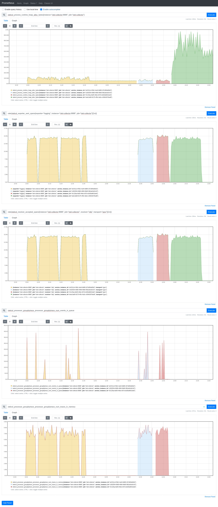
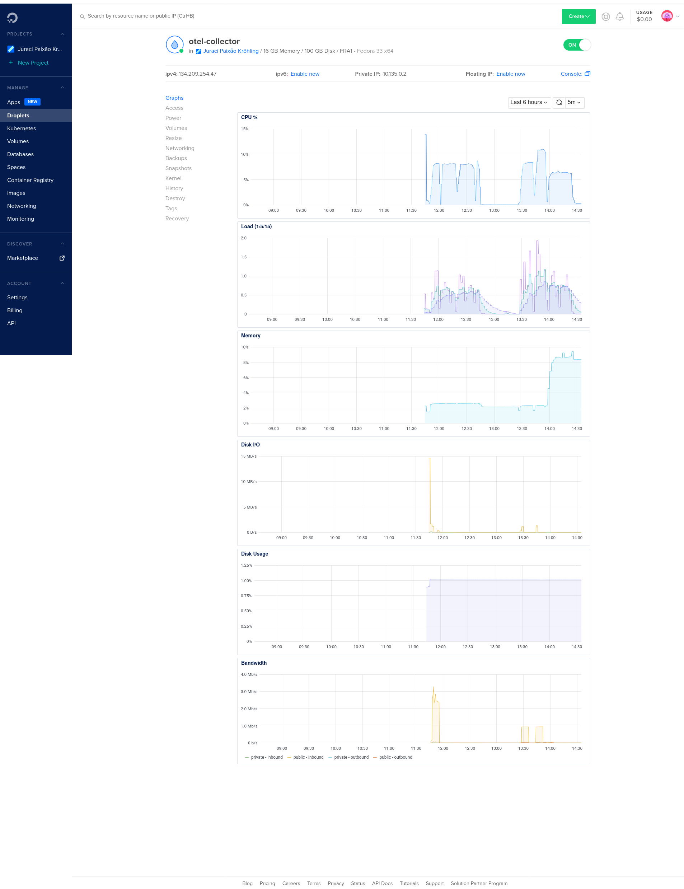

# Performance results comparing the groupbytrace processor with the tailsampling processor

## Introduction

This repository contains the results for the performance tests comparing the [`groupbytrace`](https://github.com/open-telemetry/opentelemetry-collector-contrib/tree/main/processor/groupbytraceprocessor) processor with the [`tailsampling`](https://github.com/open-telemetry/opentelemetry-collector-contrib/tree/main/processor/tailsamplingprocessor) processor. Both processors are able to hold traces in memory before dispatching them to the next consumer. Given that the tail-based sampling processor also makes sampling decisions, this comparison might not be 100% fair. Considering that most of the load and memory pressure is at the related components, this comparison still holds value.

## Motivation

The tail-based sampling has two main roles:
- holds traces in memory for a specific period of time, so that a decision is made based on the trace as a whole
- makes the sampling decision based on the configured policy

There is a discussion in the community about splitting this processor into two, so that those two concerns are handled by different processors. This is particularly appealing given that the `groupbytrace` processor exists, covering a big part of the work done by the tail-based sampling processor.

In order to make a better informed decision on whether to deprecate the existing tail-based sampling processor in favor of the existing `groupbytrace` processor plus a non-existing `policysamplingprocessor`, this performance test was performed.

## Setup

In order to make the test reproducible, they were executed in a set of DigitalOcean droplets, as follows:

- CPU-Optimized with 16GB RAM for the OpenTelemetry Collector
- Basic with 2GB RAM for Prometheus

Fedora 33 has been used as the Linux distribution for all machines.

Load is generated using the [`tracegen`](https://github.com/open-telemetry/opentelemetry-collector-contrib/tree/main/tracegen) utility. This load generator isn't representative of a real load, but is able to generate a fixed number of traces at a steady rate, making it ideal for this case. For those interested in extending this benchmark, the [Omnition/synthetic-load-generator](https://github.com/Omnition/synthetic-load-generator) is recommended as an alternative. The following command was used with both scenarios:

    $ time tracegen -traces=20_000_000 -rate=100_000 -otlp-insecure=true 2>&1 | tee tracegen.log

For the test, the OpenTelemetry Collector Contrib v0.20.0 was used, downloaded from the project's GitHub Releases page. The `tracegen` utility was installed using `go get github.com/open-telemetry/opentelemetry-collector-contrib/tracegen` locally and is transfered with the setup script. The OpenTelemetry Collector was started with:

    $ otelcontribcol_linux_amd64 --config config.groupbytrace.yaml --metrics-addr 0.0.0.0:8888 2>&1 | tee otelcol.log

The script inside the `_setup` directory was used to prepare the hosts.

## Configuration

The file `config.groupbytrace.yaml` contains the configuration used for the test using the groupbytrace processor, while the `config.tailsampling.yaml` contains the configuration for the test using the tailsampling processor.

The `prometheus.yaml` contains the Prometheus configuration to scrape the endpoints.

## Results

The [`results`](./results) directory contains the raw metrics and logs for the two scenarios.

PromQL queries:
```
otelcol_process_runtime_heap_alloc_bytes{instance="otel-collector:8888", job="otel-collector"}
rate(otelcol_exporter_sent_spans{exporter="logging", instance="otel-collector:8888", job="otel-collector"}[1m])
rate(otelcol_receiver_accepted_spans{instance="otel-collector:8888", job="otel-collector", receiver="otlp", transport="grpc"}[1m])
```

In the following graph, three runs can be seen, and the first should be discarded. Each run contains a fresh instance of the OpenTelemetry Collector, and all instances are running in the same host, with a small pause between runs to allow the machine to settle down.



And the following are the host metrics as recorded by DigitalOcean:



### To investigate

The histogram `otelcol_processor_tail_sampling_sampling_decision_timer_latency_bucket` seems to indicate that some timer is stuck pending a decision. If this is indeed the case, there might be some concurrency issue happening with the tail-based sampling processor:

## Takeaways

- The tail-based sampling processor has a 5x higher memory consumption with about 20% higher throughput.
- The groupbytrace processor has as higher CPU consumption, and very little memory usage. Making the internal buffer configurable might help improve the throughput.
- None of the scenarios got all the spans sent from the load generator acknowledged by the receiver (`otelcol_receiver_accepted_spans`). The load utility sends 20M traces (40M spans). The receiver in the tail-based scenario acknowledged around 38M spans, while the groupbytrace acknowledged around 30M spans. I cannot yet determine the cause of this, as I would expect this difference to show up in some metric, like `otelcol_receiver_refused_spans`.
- The logging exporter reports that both processors were able to process all spans that were received (`otelcol_exporter_sent_spans` vs. `otelcol_receiver_accepted_spans`).

### Next steps

- Change the groupbytrace to have a configurable buffer size
- Run a variant of this test with a candidate for the policy sampling processor, and run it with the groupbytrace scenario and a similar configuration for the tail-based sampling processor, so that we can assess the overhead of calling another processor vs. doing everything in one.
